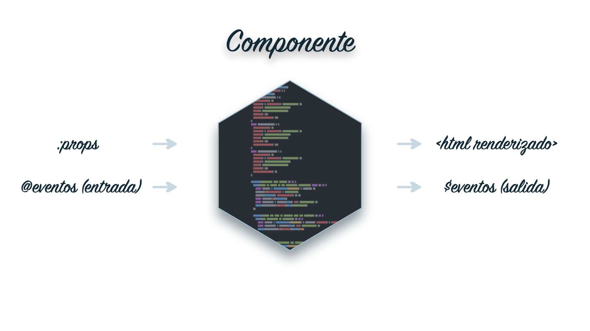
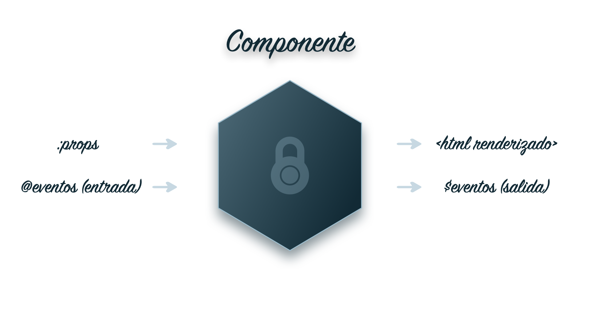

# Metodología y estructura de los tests

## Metodología

> Existen distintas formas de plantear los tests, pero aquí proponemos una de las más extendidas y que ayuda a empezar a trabajar con TDD (Test Driven Development) que es una práctica bastante extendida dentro del desarrollo de software.

### Concepto de Componente

Antes de empezar a definir una metodología es necesario entender en profundidad lo que es un componente y qué características comunes comparten todos los componentes que utilizamos dentro de nuestras apps.

> Un componente es una pieza de software que encapsula una determinada funcionalidad.

Estamos acostumbrados a utilizar componentes del Sistema de Diseño y son un buen ejemplo para entender por qué la metodología que planteamos funciona y es aconsejable seguirla. Generalmente cuando utilizamos un componente lo insertamos dentro de nuestro código y utilizamos sus `:props` para configurarlo desde fuera, lo que hace que el componente se comporte como nosotros queremos. Si en algún momento no conseguimos configurarlo correctamente buscamos en la documentación cómo se debe configurar para resolver nuestras dudas y entender cómo responde a las propiedades que utilizamos. El resultado final de insertar y configurar un componente del sistema de diseño en nuestro código es una pieza de `hmtl` dentro de nuestro navegador con la que el usuario puede interactuar o que muestra determinada información.

La documentación del Sistema de Diseño (o de cualquier componente) no es más que una API, una interfaz que nos permite dar órdenes o configurar esta pieza de software. Es una serie de opciones que nos dan los desarrolladores de estos componentes para utilizarlos.

Cuando somos nosotros quienes desarrollamos un componente, nos planteamos qué propiedades debe admitir para que funcione como debe, así como qué eventos de usuario debe escuchar para que se pueda interactuar con el. El resultado de estas **propiedades** y estos **eventos** se traduce a través de la lógica que desarrollamos en el **renderizado de un determinado html** o en la **emisión de eventos** para comunicarse con otras partes de nuestra aplicación.



Este conjunto de entradas y de salidas (que dependen de las entradas) constituye una especie de **contrato** con el desarrollador que va a utilizar este componente, y que espera que funcione como debe, siguiendo los detalles de la documentación del componente, y de forma previsible.

En ningún momento el desarrollador que utilice este componente debería verse obligado a entender cómo funciona por dentro. No le interesa de qué forma cumple sus tareas o qué lógica sigue, sólo le interesa que al configurar la **propiedad** *P* el **html renderizado** sea *P'* y que al **hacer click en el botón** *B* se emite el evento *B'*.

El componente para el desarrollador que lo utiliza es una caja negra con la que puede interactuar a través de su **API** y que va a reaccionar según la documentación de forma predecible.



## Concepto de Contrato

Por eso lo importante para garantizar que un componente funciona como debería y como se espera no es la lógica que determina su comportamiento, si no el **contrato** que se establece en la **API**, y es esto lo que se debe probar.

Esto conlleva una serie de ventajas a la hora de probar un componente. La principal ventaja es que si mantenemos el **contrato** establecido podemos modificar la lógica del componente como queramos sin comprometer el componente (ya que el test seguirá dando un resultado positivo). Esto nos permite refactorizar el componente sin miedo, ya que si en la refactorización perdemos alguna funcionalidad (incumplimos alguna de las reglas del **contrato**) el test nos avisará, y no estaremos rompiendo la aplicación.

> Esto no quiere decir que el primer paso a la hora de desarrollar un test no sea entender el código y refactorizarlo para que la lógica sea mantenible y predecible. Los tests sobre componentes [sencillos] y bien documentados son infinitamente más fáciles de hacer y mantener.

Además es más fácil definir los tests que debe pasar este componente ya que están muy relacionados con la funcionalidad y lo que esperamos de éste. Lo ideal es escribir las reglas del **contrato** del componente, y una vez presentes desarrollar tests para asegurarnos de que estas reglas se están cumpliendo.

Para comprender mejor esta metodología vamos a utilizar como ejemplo un componente que cumple la funcionalidad de contador. Al pulsar en un botón el contador incrementa su valor.

El componente tiene como propiedades (`props`):
  - `initialValue`: Valor inicial con el que empieza la cuenta

Y como eventos de entrada (`@event`):
  - El evento que emite el botón al ser clickado por un usuario.

> Puede parecer un poco confuso que estando el botón dentro de nuestro componente este evento se considere un evento de entrada, pero podemos pensar que el verdadero evento es la interacción del usuario con el ratón.

```js
<template lang="pug">
  p {{ count }}
  button(@click="handleClick") Incrementar valor
</template>

<script>
export default {
  name: "CButton",

  props: {
    initialValue: {
      type: Number,
      default: 0
    },
  },

  data() {
    return {
      counter: 0
    }
  },

  methods: {
    handleClick () {
      this.counter++
      this.$emit('count', this.count)
    }
  }
}
</script>
```

En el caso de un componente como este podríamos escribir la siguientes reglas:

- **Cuando** no se pasa un valor inicial al contador a través de la propiedad `initialValue` se **espera** que el valor del contador sea **0**.
- **Cuando** se le pasa un valor inicial al contador a través de la propiedad `initialValue` se **espera** que el valor del contador sea `initialValue`.
- **Cuando** el usuario hace click en el botón, se **espera** que el contador incremente su valor en **1** (y además se mueste este nuevo valor en la pantalla).
- **Cuando** el usuario hace click en el botón, se **espera** que el contador emita un **evento** llamado *count* con el nuevo valor del contador.

Este conjunto de reglas definen la interfaz de nuestro componente y es el contrato que debemos asegurar en el test.

Podríamos refactorizar el componente y sacar el `this.$emit('count', this.count)` a otro método que se invocaría desde el `handleClick` y al seguirse cumpliendo el contrato el test debería seguir dando un resultado positivo. La interfaz del componente no se ve alterada por esta modificación, con lo que no hay motivo para que el test falle, ningún usuario que esté utilizando este componente va a notar este cambio, ya que la funcionalidad se mantiene.

## Estructura de los archivos de Test

Si hemos configurado correctamente nuestro entorno de test, [Jest] se encargará de buscar los archivos correspondientes a la hora de lanzar los tests, por lo que es indiferente dónde dejemos estos archivos siempre y cuando estén dentro del scope que declaramos en la [configuración] de [Jest]. Se recomienda guardar los archivos de test junto con el archivo `.vue` del componente al que hacen referencia dentro de un mismo directorio bajo el nombre del componente. De esta forma tendremos los tests y los archivos del componente almacenados en un mismo directorio facilitando compartir nuestro componente y saber si dispone de tests o no.

    - src
      - components
        - component-a
          - ComponentA.vue
          - ComponentA.spec.js
        - component-b
          - ComponentB.vue
          - ComponentB.spec.js

> Se pueden encontrar snippets con versiones para VSCode y Atom para inicializar los archivos de test con esta estructura [aquí](../../snippets)

[jest]: https://jestjs.io/en/

[cli]: https://jestjs.io/docs/en/cli

[@vue/test-utils]: https://github.com/vuejs/vue-test-utils

[vue-jest]: https://github.com/vuejs/vue-jest

[configuración]: https://jestjs.io/docs/en/configuration

[babel]: https://babeljs.io/

[babel-jest]: https://www.npmjs.com/package/babel-jest

[describe]: https://jestjs.io/docs/en/api#describename-fn

[test]: https://jestjs.io/docs/en/api#testname-fn-timeout

[expect]: https://jestjs.io/docs/en/expect

[test-each]: https://jestjs.io/docs/en/api#testeachtablename-fn-timeout

[jest mock functions]: https://jestjs.io/docs/en/mock-function-api

[tohavebeencalled]: https://jestjs.io/docs/en/expect#tohavebeencalled

[tohavebeencalledwith]: https://jestjs.io/docs/en/expect#tohavebeencalledwitharg1-arg2

[mockimplementation]: https://jestjs.io/docs/en/mock-function-api#mockfnmockimplementationfn

[jsdom]: https://github.com/jsdom/jsdom

[vue mount]: https://vue-test-utils.vuejs.org/api/mount.html

[vue shallowmount]: https://vue-test-utils.vuejs.org/api/shallowMount.html

[instrucciones]: https://vue-test-utils.vuejs.org/guides/testing-single-file-components-with-jest.html

[createLocalVue]: https://vue-test-utils.vuejs.org/api/createLocalVue.html

[mounting options]: https://vue-test-utils.vuejs.org/api/options.html

[selector]: https://vue-test-utils.vuejs.org/api/selectors.html

[WrapperArray]: https://vue-test-utils.vuejs.org/api/wrapper-array/

[setChecked]: https://vue-test-utils.vuejs.org/api/wrapper/#setchecked

[setSelected]: https://vue-test-utils.vuejs.org/api/wrapper/#setselected

[sencillos]: https://en.wikipedia.org/wiki/KISS_principle
